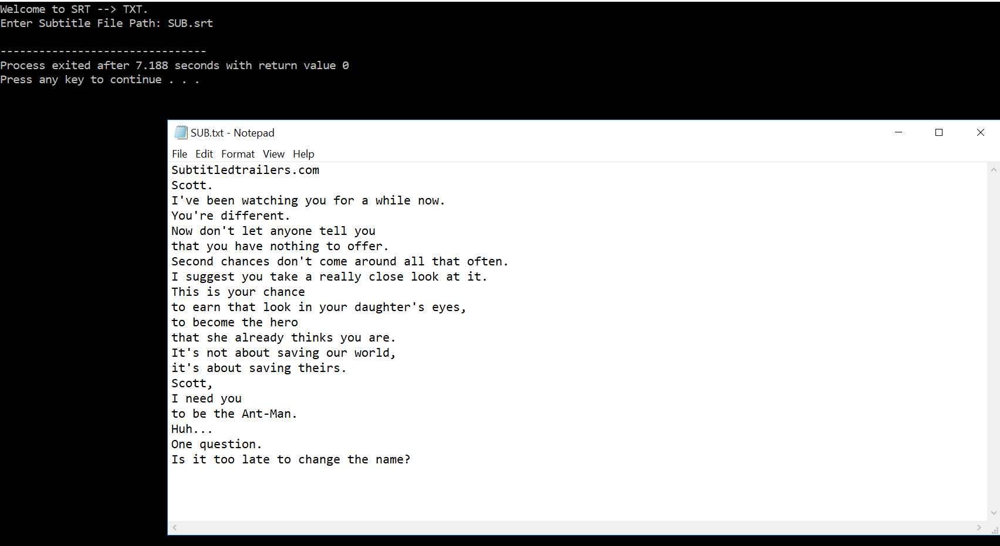

# Simple-SRT-Dialogue-to-TXT-Converter

For Google Code In 2018

A Simple SRT Dialogue to TXT Converter made with srtparser.h (https://github.com/saurabhshri/simple-yet-powerful-srt-subtitle-parser-cpp)

Enter the File Path of the SRT File and the dialogue will be outputted into a TXT File.

## Demo

Screenshot of the Program in Action

Example subtitles and output on be found in the Repo.
